# Terminal Architecture Diagrams

## System Architecture

```mermaid
flowchart TB
    subgraph Browser["` **Browser** _(Client)_ `"]
        direction LR
        React["`**React 19** + Vite 7`"]
        XTerm["`**xterm.js** Terminal`"]
        Auth["`Auth UI
        _(Login/Register)_`"]
        Theme["`🌙 Theme Toggle`"]
    end

    subgraph API["` **API Server** _(Node.js)_ `"]
        direction TB
        Fastify["`**Fastify 5**`"]
        WS["`WebSocket Handler`"]
        AuthService["`Auth Service
        _(JWT + bcrypt)_`"]
        Session["`Session Manager`"]
        ValkeyClient1["`Valkey Client`"]
    end

    subgraph Valkey["` **Valkey** _(Redis-compatible)_ `"]
        direction TB
        PubSub["`**Pub/Sub Channels**`"]
        GatewayCtrl["`gateway.control`"]
        PtyInput["`pty.input.*`"]
        PtyOutput["`pty.output.*`"]
        PtyControl["`pty.control.*`"]
    end

    subgraph Gateway["` **TN3270 Gateway** _(Python)_ `"]
        direction TB
        AsyncIO["`**asyncio** Runtime`"]
        ValkeyClient2["`Valkey Client`"]
        Tn3270Manager["`TN3270 Manager`"]
        Tn3270Session1["`TN3270 Session 1`"]
        Tn3270Session2["`TN3270 Session 2`"]
        Tn3270SessionN["`TN3270 Session N`"]
    end

    React --> Auth & XTerm & Theme
    
    Auth -->|"`**HTTP REST**`"| AuthService
    XTerm -->|"`**WebSocket**`"| WS
    
    WS --> Session & ValkeyClient1
    AuthService --> Session
    
    ValkeyClient1 -->|"`_Publish_`"| PubSub
    PubSub -->|"`_Subscribe_`"| ValkeyClient2
    
    ValkeyClient2 --> Tn3270Manager
    Tn3270Manager --> Tn3270Session1 & Tn3270Session2 & Tn3270SessionN
```

## Authentication Flow

```mermaid
sequenceDiagram
    autonumber
    
    participant B as 🌐 Browser
    participant A as ⚡ API Server
    participant DB as 💾 User Store

    rect rgb(50, 40, 50)
        Note over B,DB: Registration
        B->>+A: POST /auth/register<br/>{email, password}
        A->>A: Validate input
        A->>A: Hash password (bcrypt)
        A->>DB: Store user
        A->>A: Generate JWT
        A-->>-B: {token, user}
        B->>B: Store in localStorage
    end

    rect rgb(40, 50, 50)
        Note over B,DB: Login
        B->>+A: POST /auth/login<br/>{email, password}
        A->>DB: Find user by email
        A->>A: Verify password (bcrypt)
        A->>A: Generate JWT
        A-->>-B: {token, user}
        B->>B: Store in localStorage
    end

    rect rgb(40, 40, 60)
        Note over B,DB: Authenticated Request
        B->>+A: GET /auth/me<br/>Authorization: Bearer {token}
        A->>A: Verify JWT
        A-->>-B: {user}
    end
```

## Terminal Session Lifecycle

```mermaid
sequenceDiagram
    autonumber
    
    participant B as 🌐 Browser
    participant A as ⚡ API Server
    participant V as 📡 Valkey
    participant G as 🐍 Gateway
    participant T as 🖥️ TN3270 Host

    rect rgb(40, 60, 40)
        Note over B,T: Session Creation
        B->>+A: WebSocket Connect<br/>/terminal/:sessionId?token=xxx
        A->>A: Validate JWT
        A->>-A: Create session record

        B->>+A: session.create message
        A->>V: PUBLISH gateway.control
        V->>+G: MESSAGE
        G->>+T: connect(host, port)
        G->>G: Subscribe to tn3270.input/:id
        G->>V: PUBLISH tn3270.output/:id<br/>(session.created)
        V->>A: MESSAGE
        A-->>-B: session.created message
    end

    rect rgb(40, 50, 60)
        Note over B,T: Data Exchange
        B->>A: data message (keystroke)
        A->>V: PUBLISH tn3270.input/:id
        V->>G: MESSAGE
        G->>T: send(data)
        T->>G: receive(output)
        G->>V: PUBLISH tn3270.output/:id
        V->>A: MESSAGE
        A->>B: data message (output)
    end

    rect rgb(40, 50, 60)
        Note over B,T: Terminal Resize
        B->>A: resize message {cols, rows}
        A->>V: PUBLISH tn3270.control/:id
        V->>G: MESSAGE
        G->>T: send resize command
    end

    rect rgb(60, 40, 40)
        Note over B,T: Session Cleanup
        B->>A: WebSocket Close
        A->>V: PUBLISH tn3270.control/:id<br/>(session.destroy)
        V->>G: MESSAGE
        G->>T: disconnect
        deactivate T
        G->>G: Unsubscribe channels
        deactivate G
        G->>V: PUBLISH tn3270.output/:id<br/>(session.destroyed)
    end
```

## Message Flow

```mermaid
flowchart LR
    subgraph Browser["` **Browser** `"]
        XT["`📺 **xterm.js**`"]
    end

    subgraph API["` **API Server** `"]
        direction TB
        WSH["`🔌 WebSocket Handler`"]
        VC1["`Valkey Client`"]
    end

    subgraph Valkey["` **Valkey Pub/Sub** `"]
        direction TB
        GC["`📣 gateway.control`"]
        PI["`⌨️ tn3270.input.*`"]
        PO["`📤 tn3270.output.*`"]
        PC["`🎛️ tn3270.control.*`"]
    end

    subgraph Gateway["` **Python Gateway** `"]
        direction TB
        VC2["`Valkey Client`"]
        PM["`🔧 TN3270 Manager`"]
        PTY["`🖥️ TN3270 Host`"]
    end

    XT -->|"`_session.create_
    _data_
    _resize_`"| WSH
    WSH -->|"`Publish`"| VC1
    VC1 --> GC & PI & PC
    
    GC & PI & PC -->|"`Subscribe`"| VC2
    
    VC2 <--> PM <--> PTY
    PM -->|"`Publish`"| VC2
    VC2 --> PO
    
    PO -->|"`Subscribe`"| VC1
    VC1 --> WSH
    WSH -->|"`_session.created_
    _data_
    _error_`"| XT
```

## Component Dependencies

```mermaid
flowchart BT
    subgraph Packages["` **📦 Packages** `"]
        Shared["`**@terminal/shared**
        _Types & Utils_`"]
    end

    subgraph Apps["` **🚀 Apps** `"]
        Web["`**@terminal/web**
        _React Frontend_`"]
        API["`**@terminal/api**
        _Fastify Backend_`"]
    end

    subgraph External["` **🔧 External** `"]
        Gateway["`**gateway**
        _Python TN3270_`"]
        Valkey["`**Valkey**
        _Docker_`"]
    end

    Web --> Shared
    API --> Shared
    API <--> Valkey <--> Gateway
    Web --> API
```

## State Management

```mermaid
stateDiagram-v2
    direction LR
    
    [*] --> Disconnected
    
    Disconnected --> Connecting: connect()
    Connecting --> Connected: WebSocket open
    Connecting --> Error: Connection failed
    
    Connected --> Disconnected: disconnect()
    Connected --> Reconnecting: Connection lost
    Connected --> Error: Fatal error
    
    Reconnecting --> Connected: ✅ Reconnect success
    Reconnecting --> Error: ❌ Max retries exceeded
    
    Error --> Connecting: 🔄 Retry
    Error --> [*]: Give up

    note right of Connected
        Active terminal session
        Sending/receiving data
    end note

    note left of Reconnecting
        Auto-reconnect with
        exponential backoff
    end note
```

## TN3270 Session States

```mermaid
stateDiagram-v2
    direction TB

    [*] --> Creating: session.create received

    Creating --> Active: ✅ connect success
    Creating --> Failed: ❌ connection error

    state Active {
        direction LR
        [*] --> Running
        Running --> Running: I/O operations
        Running --> Resizing: resize message
        Resizing --> Running: resize sent
    }

    Active --> Destroying: session.destroy / disconnect
    Active --> Disconnected: Connection lost

    Destroying --> Cleanup: disconnect sent
    Cleanup --> [*]: Resources freed

    Disconnected --> Cleanup: Detected by read()
    Failed --> [*]: Error sent to client
```

## Deployment Architecture

```mermaid
flowchart TB
    subgraph Users["` **👥 Users** `"]
        U1["`👤 User 1`"]
        U2["`👤 User 2`"]
        UN["`👤 User N`"]
    end

    subgraph LoadBalancer["` **⚖️ Load Balancer** `"]
        LB["`**nginx / ALB**
        _Sticky sessions for WS_`"]
    end

    subgraph WebServers["` **🌐 Web Servers (Static)** `"]
        W1["`**CDN / Static Host**
        _Vite build output_`"]
    end

    subgraph APIServers["` **⚡ API Servers (Scalable)** `"]
        direction LR
        A1["`API Instance 1`"]
        A2["`API Instance 2`"]
    end

    subgraph MessageBroker["` **📡 Message Broker** `"]
        V["`**Valkey Cluster**
        _Pub/Sub + Persistence_`"]
    end

    subgraph Tn3270Gateways["` **🐍 TN3270 Gateways (Scalable)** `"]
        direction LR
        G1["`Gateway 1
        _10 sessions max_`"]
        G2["`Gateway 2
        _10 sessions max_`"]
    end

    U1 & U2 & UN --> LB
    
    LB -->|"`Static Assets`"| W1
    LB -->|"`API / WebSocket`"| A1 & A2
    
    A1 & A2 <--> V <--> G1 & G2
```

