# Terminal Architecture Diagrams

## System Architecture

## Frontend State Architecture

## Authentication Flow (Azure Entra ID)

## Terminal Session Lifecycle

```mermaid
sequenceDiagram
    autonumber
    
    participant B as 🌐 Browser
    participant A as ⚡ API Server
    participant V as 📡 Valkey
    participant G as 🐍 Gateway
    participant T as 🖥️ TN3270 Host

    rect rgb(40, 60, 40)
        Note over B,T: Session Creation
        B->>+A: WebSocket Connect<br/>/terminal/:sessionId?token=xxx
        A->>A: Validate JWT
        A->>-A: Create session record

        B->>+A: session.create message
        A->>V: PUBLISH gateway.control
        V->>+G: MESSAGE
        G->>+T: connect(host, port)
        G->>G: Subscribe to tn3270.input/:id
        G->>V: PUBLISH tn3270.output/:id<br/>(session.created)
        V->>A: MESSAGE
        A-->>-B: session.created message
    end

    rect rgb(40, 50, 60)
        Note over B,T: Data Exchange
        B->>A: data message (keystroke)
        A->>V: PUBLISH tn3270.input/:id
        V->>G: MESSAGE
        G->>T: send(data)
        T->>G: receive(output)
        G->>V: PUBLISH tn3270.output/:id
        V->>A: MESSAGE
        A->>B: data message (output)
    end

    rect rgb(50, 50, 40)
        Note over B,T: Navigation Away (Session Persists)
        B->>A: WebSocket Close
        Note over A,G: Session remains active<br/>No destroy message sent
        B->>B: Navigate to /history
    end

    rect rgb(40, 50, 60)
        Note over B,T: Navigate Back (Reconnect)
        B->>+A: WebSocket Connect<br/>/terminal/:sessionId?token=xxx
        A->>A: Validate JWT
        A->>V: SUBSCRIBE tn3270.output/:id
        Note over A,G: Reconnect to existing session
        A-->>-B: Receive buffered output
    end

    rect rgb(60, 40, 40)
        Note over B,T: Explicit Session Close (Tab Close)
        B->>A: session.destroy message
        A->>V: PUBLISH gateway.control
        V->>G: MESSAGE
        G->>T: disconnect
        deactivate T
        G->>G: Unsubscribe channels
        deactivate G
        G->>V: PUBLISH tn3270.output/:id<br/>(session.destroyed)
    end
```

## AST Execution Flow

```mermaid
sequenceDiagram
    autonumber
    
    participant B as 🌐 Browser
    participant A as ⚡ API Server
    participant V as 📡 Valkey
    participant G as 🐍 Gateway
    participant T as 🖥️ TN3270 Host
    participant DB as 💾 DynamoDB

    rect rgb(40, 50, 60)
        Note over B,DB: AST Execution Start
        B->>A: ast.run {name: "login", params: {...}}
        A->>V: PUBLISH tn3270.input/:id
        V->>G: MESSAGE
        G->>DB: PutItem (Executions) - status: running
        G->>V: PUBLISH tn3270.output/:id (ast.status: running)
        V->>A: MESSAGE
        A->>B: ast.status {status: running}
    end

    rect rgb(40, 60, 50)
        Note over B,DB: Policy Processing Loop
        loop For each policy
            G->>T: Execute TN3270 commands
            T->>G: Response
            G->>DB: PutItem (Policies)
            G->>V: PUBLISH tn3270.output/:id (ast.item_result)
            V->>A: MESSAGE
            A->>B: ast.item_result {itemId, status}
            G->>V: PUBLISH tn3270.output/:id (ast.progress)
            V->>A: MESSAGE
            A->>B: ast.progress {current, total}
        end
    end

    rect rgb(40, 50, 60)
        Note over B,DB: AST Completion
        G->>DB: UpdateItem (Executions) - status: success
        G->>V: PUBLISH tn3270.output/:id (ast.status: success)
        V->>A: MESSAGE
        A->>B: ast.status {status: success, duration}
    end
```

## Message Flow

```mermaid
flowchart LR
    subgraph Browser["` **Browser** `"]
        XT["`📺 **xterm.js**`"]
        AST["`🔧 **AST Panel**`"]
    end

    subgraph API["` **API Server** `"]
        direction TB
        WSH["`🔌 WebSocket Handler`"]
        VC1["`Valkey Client`"]
    end

    subgraph Valkey["` **Valkey Pub/Sub** `"]
        direction TB
        GC["`📣 gateway.control`"]
        PI["`⌨️ tn3270.input.*`"]
        PO["`📤 tn3270.output.*`"]
        PC["`🎛️ tn3270.control.*`"]
    end

    subgraph Gateway["` **Python Gateway** `"]
        direction TB
        VC2["`Valkey Client`"]
        PM["`🔧 TN3270 Manager`"]
        AE["`🤖 AST Engine`"]
        PTY["`🖥️ TN3270 Host`"]
    end

    XT -->|"`_session.create_
    _data_
    _resize_`"| WSH
    AST -->|"`_ast.run_
    _ast.control_`"| WSH
    WSH -->|"`Publish`"| VC1
    VC1 --> GC & PI & PC
    
    GC & PI & PC -->|"`Subscribe`"| VC2
    
    VC2 <--> PM & AE
    PM <--> PTY
    AE <--> PM
    PM -->|"`Publish`"| VC2
    AE -->|"`Publish`"| VC2
    VC2 --> PO
    
    PO -->|"`Subscribe`"| VC1
    VC1 --> WSH
    WSH -->|"`_session.created_
    _data_
    _ast.status_
    _ast.progress_`"| XT & AST
```

## Component Dependencies

```mermaid
flowchart BT
    subgraph Packages["` **📦 Packages** `"]
        Shared["`**@terminal/shared**
        _Types & Utils_`"]
    end

    subgraph Apps["` **🚀 Apps** `"]
        Web["`**@terminal/web**
        _React + Zustand_`"]
        API["`**@terminal/api**
        _Fastify Backend_`"]
    end

    subgraph External["` **🔧 External** `"]
        Gateway["`**gateway**
        _Python TN3270_`"]
        Valkey["`**Valkey**
        _Docker_`"]
        DynamoDB["`**DynamoDB**
        _AWS/Local_`"]
        Mainframe["`**Mainframe**
        _TN3270 Host_`"]
    end

    Web --> Shared
    API --> Shared
    API <--> Valkey <--> Gateway
    API --> DynamoDB
    Gateway --> DynamoDB
    Gateway --> Mainframe
    Web --> API
```

## State Management

```mermaid
stateDiagram-v2
    direction LR
    
    [*] --> Disconnected
    
    Disconnected --> Connecting: connect()
    Connecting --> Connected: WebSocket open
    Connecting --> Error: Connection failed
    
    Connected --> Disconnected: disconnect()
    Connected --> Reconnecting: Connection lost
    Connected --> Error: Fatal error
    
    Reconnecting --> Connected: ✅ Reconnect success
    Reconnecting --> Error: ❌ Max retries exceeded
    
    Error --> Connecting: 🔄 Retry
    Error --> [*]: Give up

    note right of Connected
        Active terminal session
        Sending/receiving data
        Session persists on navigation
    end note

    note left of Reconnecting
        Auto-reconnect with
        exponential backoff
    end note
```

## TN3270 Session States

```mermaid
stateDiagram-v2
    direction TB

    [*] --> Creating: session.create received

    Creating --> Active: ✅ connect success
    Creating --> Failed: ❌ connection error

    state Active {
        direction LR
        [*] --> Idle
        Idle --> Running: ast.run
        Running --> Running: I/O operations
        Running --> Paused: ast.control(pause)
        Paused --> Running: ast.control(resume)
        Running --> Idle: ast complete
        Idle --> Idle: data I/O
    }

    Active --> WebSocketDisconnected: WS close (navigation)
    WebSocketDisconnected --> Active: WS reconnect
    
    Active --> Destroying: session.destroy (tab close)
    WebSocketDisconnected --> Destroying: session.destroy

    Destroying --> Cleanup: disconnect sent
    Cleanup --> [*]: Resources freed

    Failed --> [*]: Error sent to client
```

## AWS Deployment Architecture (Production)

```mermaid
flowchart TB
    subgraph Users["` **👥 Users** `"]
        U1["`👤 User 1`"]
        U2["`👤 User 2`"]
        UN["`👤 User N`"]
    end

    subgraph AWS["` **☁️ AWS Cloud** `"]
        subgraph VPC["` **VPC** `"]
            subgraph PublicSubnet["` **Public Subnets** `"]
                ALB["`**Application Load Balancer**
                _HTTPS + WebSocket_
                _Sticky Sessions_`"]
            end

            subgraph PrivateSubnet["` **Private Subnets** `"]
                subgraph ECSAPI["` **ECS Cluster (API)** `"]
                    API1["`API Task 1`"]
                    API2["`API Task 2`"]
                end

                subgraph EC2Gateway["` **EC2 Auto Scaling** `"]
                    GW1["`Gateway Instance 1
                    _(10 sessions)_`"]
                    GW2["`Gateway Instance 2
                    _(10 sessions)_`"]
                end

                ElastiCache["`**ElastiCache**
                _(Valkey/Redis)_`"]
            end
        end

        DynamoDB2["`**DynamoDB**
        _(On-Demand)_`"]
        
        S3["`**S3 + CloudFront**
        _(Static Assets)_`"]
    end

    subgraph OnPrem["` **On-Premises / Direct Connect** `"]
        Mainframe2["`🖥️ **Mainframe**
        _(TN3270)_`"]
    end

    U1 & U2 & UN --> S3
    U1 & U2 & UN --> ALB

    ALB --> API1 & API2
    API1 & API2 <--> ElastiCache
    API1 & API2 --> DynamoDB2
    
    ElastiCache <--> GW1 & GW2
    GW1 & GW2 --> DynamoDB2
    GW1 & GW2 -->|"`Direct Connect / VPN`"| Mainframe2
```

## Development Architecture

